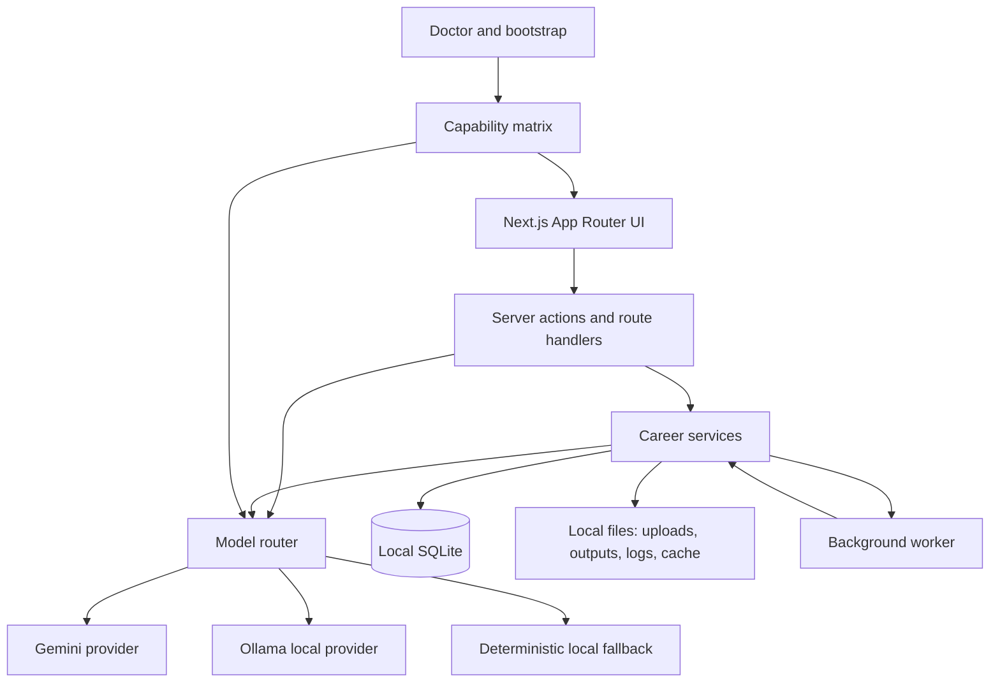

# Local-First Model-Agnostic Plan

Status: Phase 4 job discovery and Coach RAG architecture update
Last reviewed: 2026-04-30
Scope: local-first architecture, provider routing, and proof strategy

## Goal

Career Seek should remain a local-first job-search cockpit while removing Gemini as a hard product dependency. A fresh install should work with one command, require no cloud API key, prefer a local Ollama model when available, and degrade honestly to deterministic/template behavior when no model provider is ready.

## Current Baseline

Evidence reviewed:

- `README.md` documents one-command macOS/Windows installers plus `npm run bootstrap`, `npm run launch`, and `npm run doctor`.
- `package.json` exposes `bootstrap`, `launch`, `launch:dev`, `doctor`, `build`, `typecheck`, `audit:workbench`, `worker`, and `proof:final`.
- `docs/CURRENT_STATE_AND_GAPS.md`, `docs/LOCAL_RUNBOOK.md`, `docs/ARCHITECTURE_AND_DATA.md`, `docs/AI_COACH_AND_RAG.md`, `docs/JOB_DISCOVERY_AND_RANKING.md`, `docs/APPLICATIONS_AND_DOCUMENTS.md`, and `docs/PRODUCT_FLOW.md` describe the current local SQLite, Next.js, Playwright, Gemini, RAG, scraping, and CRM boundaries.
- `docs/qa/proof-harness.md` describes a four-candidate service-layer proof harness. The Phase 2 scripts now report `aiProviderProof` metadata for no-key, Ollama, configured cloud, OpenAI-compatible, and deterministic modes without requiring real external keys.
- Current legacy AI code paths still include Gemini-centered services, but Phase 1 introduced a provider-neutral manager and Phase 2 proof scripts now distinguish "provider detected" from "provider exercised."
- Some deterministic fallbacks already exist for profile extraction, JD analysis, tailored resumes, cover letters, outreach, and coach answer failure paths.
- Phase 4 adds an optional local Meilisearch-compatible job index, local dream-job ranking, source-health labels for gated boards, and a model-agnostic Coach RAG engine.

Current product risk:

- Some older workflows and proof fields still carry compatibility names such as `gemini` because downstream consumers may read them.
- Proof and capability language must now treat Gemini as one provider among many: OpenAI, Anthropic, Gemini, Groq, DeepSeek, OpenAI-compatible endpoints, Ollama, and deterministic local fallback.
- RAG embeddings must remain provider/model/dimension aware. A model-agnostic RAG layer must avoid mixing incompatible embedding spaces.

## Target Architecture



The model router owns provider selection and exposes stable task APIs:

- `validateProvider`
- `generateJson`
- `generateText`
- `embedDocuments`
- `embedQuery`
- `summarizeFailure`

Every AI task should declare:

- task type: profile extraction, JD analysis, resume tailoring, cover letter, outreach, ATS check, coach answer, email draft, embedding
- required output schema
- provider preference and fallback policy
- timeout, retry, and logging policy
- whether deterministic fallback is allowed

Provider priority should be:

1. User-selected configured provider, for example Gemini with a valid key.
2. Ollama when no cloud key is configured and an approved local model is reachable.
3. Deterministic/template local fallback with visible limitations.

## Phase 3 ATS And Document Generation Contract

Phase 3 should make scoring and generated files predictable for a job seeker. The user should not need to understand model providers, vector stores, or rendering engines to answer three questions:

- Why did this job score well or poorly?
- What should I change before applying?
- Which files can I upload or paste into the application form?

ATS scoring must stay local and repeatable:

- Calculate keyword overlap from the resume/profile and job description.
- Calculate semantic similarity with local embeddings so related wording can count even when exact terms differ.
- Check basic resume structure, including contact details, role dates, section names, measurable bullets, education, and missing required skills.
- Combine those local signals into one advisory score with visible sub-scores.

AI should help with explanation, not decide the score:

- With a provider configured, ask the selected model for short qualitative feedback and safe rewrite suggestions.
- Without a provider, show the same score, matched terms, missing terms, and deterministic checklist.
- Never ask an AI model to certify that a resume will pass an employer ATS.
- Never let AI invent experience, dates, employers, degrees, certifications, or salary claims.

Document generation must produce inspectable assets:

- Render ATS-safe DOCX and PDF from structured resume data.
- Keep a JSON sidecar with the exact structured resume used for that version.
- Keep a text sidecar for application portals that require paste-in fields.
- Store provider/model metadata when AI rewrites any content.
- Keep deterministic generation available with no key.

Embedding behavior must be local-first:

- Prefer a local embedding model when available.
- Use deterministic keyword-hash vectors as the guaranteed no-key floor.
- Record embedding provider, model, dimensions, and mode with chunks and runs.
- Reindex when embedding settings change so scores do not mix incompatible vector spaces.

Practical caveats to show in docs and UI:

- The score is guidance, not an employer result.
- Short job descriptions make weaker scores.
- A high semantic match can still miss a required keyword, so both signals should be visible.
- AI feedback is optional and advisory.
- Blocked job boards may require the user to paste or save the job description before generating documents.

## Phase 4 Job Discovery And Coach Contract

Phase 4 makes search and coaching useful without turning local infrastructure into a hard dependency.

Job search:

- SQLite remains the source of truth.
- Scored jobs are indexed into local Meilisearch when `MEILI_HOST` or `MEILISEARCH_URL` is reachable.
- If Meilisearch is not running, Discover uses local in-process filtering over saved/scored jobs.
- Search never requires a remote search API.

Dream-job discovery:

- Users can describe an ideal role in Discover.
- The app ranks saved jobs with local embeddings and cosine similarity.
- Qdrant is used only when configured and local; otherwise ranking uses deterministic in-memory vectors.
- The ranked result is advisory and still displayed alongside the regular local job score.

Source hardening:

- LinkedIn, Indeed, and Instahyre failures are labeled as auth-gated, blocked/rate-limited, fallback-only, or unstable where applicable.
- Portal failures recommend local alternatives such as official company pages, ATS pages, jobspy fallback, or manual URL import.
- Product Manager searches now downrank Strategy/Ops roles when the title lacks a real product signal.

Coach RAG:

- Coach questions are embedded locally before retrieval.
- The Coach uses `AIManager` only when the user has configured a generation provider.
- With no provider, the Coach returns a cited local evidence summary.
- Answers include source references, confidence, caveats, and generation diagnostics.

## Single-Command Install Contract

The installer and `npm run bootstrap` should continue to be the canonical setup path.

The install must:

- Install dependencies, Playwright Chromium, local data folders, SQLite schema, K-1 bootstrap migration, source seed data, doctor, and production build.
- Never require `GEMINI_API_KEY`, `GOOGLE_GENERATIVE_AI_API_KEY`, or any other cloud key to finish.
- Detect Ollama, but not block installation if Ollama is missing, stopped, or has no pulled model.
- Write model capability details into the local capability matrix.
- Launch into a usable app state with clear AI availability labels.

Recommended doctor fields:

- `has_ai_provider`
- `selected_provider`
- `has_cloud_key`
- `has_ollama`
- `ollama_base_url`
- `ollama_chat_model`
- `ollama_embedding_model`
- `embedding_provider`
- `embedding_dimensions`
- `safe_modes.ai_generation_limited`
- `safe_modes.local_model_unavailable`
- `safe_modes.embedding_reindex_required`

Recommended default local model behavior:

- Do not auto-download large models during the base install.
- If `ollama` is present and a configured model is available, use it automatically when no cloud key exists.
- If `ollama` is present but no model exists, show the exact recommended pull command in doctor/settings.
- If no provider is available, keep onboarding available through deterministic extraction and explicit manual review.

## Four-Phase Roadmap

### Phase 1: Provider Abstraction And No-Key First Run

Outcome: Career Seek can complete a fresh local setup without a cloud key.

Work:

- Introduce a provider-neutral model contract around text generation, JSON generation, embeddings, validation, retries, timeouts, telemetry, and safe error messages.
- Preserve Gemini behavior behind a Gemini provider adapter.
- Add an Ollama provider adapter for local chat generation and embeddings.
- Change onboarding architecture so "no cloud key" is not a blocker when Ollama or deterministic fallback can build a reviewable profile.
- Expand doctor/capabilities to distinguish browser, OCR, cloud AI, Ollama, embeddings, and deterministic fallback.
- Record provider and model metadata with AI request logs and generated assets.
- Define reindex behavior when embedding provider, model, or dimensions change.

Acceptance criteria:

- Fresh `npm run bootstrap` succeeds with no API keys.
- Fresh onboarding can reach dashboard with no key using Ollama if available, or deterministic fallback if not.
- Missing AI provider is visible as limited mode, not a crash or dead end.
- Existing Gemini key flow still works.
- Existing deterministic fallbacks remain available and clearly labeled.

### Phase 2: Migrate AI Features To The Router

Outcome: Feature code no longer imports Gemini directly.

Work:

- Route profile extraction, clarification refinement, JD analysis, job brief, resume tailoring, ATS check, cover letter, outreach, AI email, coach answers, and embeddings through the model router.
- Add schema validation per task so every provider must return the same internal shape.
- Add prompt/output compatibility tests for Gemini, Ollama, and deterministic modes.
- Make RAG retrieval provider-aware. Never compare vectors produced by different embedding models or dimensions.
- Add UI copy and settings controls for provider selection, local model status, and reindex prompts.
- Update proof harnesses so no-key, Ollama-detected, cloud-provider-configured, OpenAI-compatible, and deterministic modes are reported without requiring real provider credentials during routine QA.

Acceptance criteria:

- `rg "@google/generative-ai" src` only finds provider adapter code.
- No user-facing workflow requires a Gemini key by name.
- Coach can answer with local Ollama when embeddings are available, and gives an evidence-first fallback when they are not.
- QA reports include `aiProviderProof.activeProvider`, `noKeyPathAvailable`, `ollamaConfigured`, `cloudConfigured`, and a provider matrix.
- Legacy proof fields such as `gemini` remain only as compatibility fields and are labeled as such.

### Phase 3: Local-First Reliability And Offline QA

Outcome: The local app behaves predictably across restart, provider outage, and source drift.

Work:

- Harden worker recovery for scans, document jobs, indexing jobs, and model timeouts.
- Add provider outage scenarios to the proof harness.
- Add install smoke checks for macOS and Windows paths.
- Expand the four-candidate QA harness to run a provider matrix: deterministic, Ollama, Gemini when key is present.
- Persist source/provider failure taxonomy with enough detail for support without leaking keys or resume content.
- Prove old local proof data cannot contaminate fresh runs when `JOBHUNT_DATA_DIR` is set.
- Prove composite ATS scoring works with no key: keyword score, semantic score, structure score, and readable improvement checklist.
- Prove document jobs generate ATS-safe DOCX/PDF plus JSON/text sidecars from structured resume data.
- Prove AI qualitative feedback is optional: provider outage should not block the score, sidecars, or deterministic documents.

Acceptance criteria:

- Interrupted scans and document jobs resume or fail visibly after restart.
- QA can prove the same core workflows without a cloud key.
- Route checks, proof harness, and screenshots can be collected from an isolated data directory.
- A no-key run can generate an ATS report, tailored resume, cover letter draft, and sidecars.
- The ATS report explains local keyword, semantic, and structure signals separately.
- AI-generated feedback is labeled with provider/model metadata when used and omitted cleanly when unavailable.
- Generated files stay inside the local Career Seek data directory and are linked to the application/job.

### Phase 4: Release Hardening And Distribution

Outcome: Career Seek is shippable as a local-first, model-agnostic desktop-style web app.

Work:

- Finalize one-command installer messaging for cloud-key, Ollama, and deterministic modes.
- Add backup/export guidance for local data.
- Add provider migration docs for users moving from Gemini to Ollama or another provider.
- Complete the dependency upgrade/audit pass already noted in current docs.
- Run clean manual proof from install through onboarding, scan, generated assets, pipeline, documents, analytics, and coach.

Acceptance criteria:

- README and runbook describe the no-key path as the default safe install.
- Release proof includes at least one clean no-key run and one configured-provider run.
- All AI-generated or AI-adjacent outputs remain advisory, grounded, and local-data aware.

## Test Strategy

Use existing commands as the first ring:

```bash
npm run build
npm run typecheck
npm run doctor
npm run audit:workbench
npm run proof:final
npx tsx scripts/qa/proof-harness.ts --ai=off --coach=off
npx tsx scripts/qa/proof-harness.ts --ai=auto --coach=off
npx tsx scripts/qa/run-four-candidate-proof.mjs
```

Recommended provider matrix:

| Scenario | Required env | Expected result |
| --- | --- | --- |
| Deterministic no-key | unset cloud keys, Ollama stopped | proof uses deterministic fallback and reports `activeProvider: deterministic` |
| Ollama no-key | unset cloud keys, `OLLAMA_BASE_URL` or Ollama model hint present | proof reports Ollama as configured without requiring a live model in routine QA |
| Gemini configured | `GEMINI_API_KEY` or settings key | existing Gemini-backed proof path remains compatible and is labeled legacy/exercised |
| Other cloud configured | OpenAI, Anthropic, Groq, DeepSeek, or OpenAI-compatible env/settings present | proof matrix records the provider without making live external calls by default |
| Provider outage | configured provider times out in runtime task tests | task falls back or fails visibly with safe error text |
| Embedding model change | switch embedding provider/model | reindex required, old vectors not mixed with new vectors |

Additional tests to add:

- Provider contract unit tests with a fake model adapter.
- Ollama API mock tests for chat, embeddings, timeout, malformed JSON, and unavailable model.
- Schema validation tests for each AI task output.
- Fresh `JOBHUNT_DATA_DIR` onboarding smoke for no-key, Ollama/local, and at least one configured-provider path.
- RAG retrieval tests proving provider/dimension isolation.
- Key-scrubbing tests for logs, QA reports, capabilities, and errors.
- Installer smoke tests that prove setup does not require an API key.
- Provider-matrix proof tests that assert no external key is required for deterministic QA and that detected providers are never mistaken for fully exercised providers.
- ATS scoring tests for keyword-only, semantic-only, mixed match, and weak job-description cases.
- Document asset tests that verify DOCX/PDF plus JSON/text sidecars are created and linked to the correct application.
- No-key document-generation tests proving AI feedback is skipped without blocking downloads.

## Key Recommendations

- Make "no key needed" a product invariant, not just a fallback implementation detail.
- Keep Gemini as a first-class provider, but remove Gemini-specific naming from generic onboarding, settings, capabilities, and QA language.
- Treat Ollama as the default no-key provider when present, while keeping deterministic mode as the guaranteed floor.
- Do not auto-pull heavy Ollama models during standard install unless the user explicitly opts in.
- Store provider, model, and embedding dimension metadata anywhere generated text, vector chunks, or AI logs are persisted.
- Prefer exact, user-visible capability states over silent degradation: cloud unavailable, local model unavailable, embedding reindex required, browser scraping disabled, OCR manual recovery likely.
- Keep QA language provider-neutral while preserving compatibility fields until all report readers migrate.
- Keep the ATS score explainable: show what matched, what is missing, and what the user can safely change.
- Keep generated documents boring in the best way: clean headings, real dates, real experience, no graphics that confuse upload portals, and paste-friendly sidecars.
